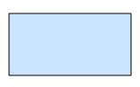
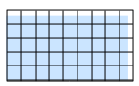
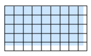
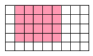

.. _concepts.gridsets:

Gridsets and Gridsubsets
========================

**Gridsets** and **gridsubsets** refer to the spatial reference system of the layers served by GeoWebCache. By nature and as introduced in the :ref:`concepts.tiles`, GeoWebCache is agnostic to reference-systems. When GeoWebCache makes a request to a WMS, it uses the gridset and gridsubset information to convert its internal tile index to a spatial request that the WMS will understand.

A **gridset** is a global definition (i.e. not layer-specific) specifying:

  * A spatial reference system (EPSG code)
  * A bounding box describing the extent, typically the maximum extent for the above reference system
  * One of either a list of scale denominators, resolutions, or zoom levels
  * The tile dimensions in pixels (constant for all zoom levels)
  * *(Optional)* Pixel size (to calculate scales).  The default is 0.28mm/pixel, corresponding to 90.71428571428572 DPI.

A **gridsubset** is a layer-specific definition specifying:

  * The gridset for the layer
  * *(Optional)* The bounding box for that layer (which must be a subset of the extent of the gridSet)
  * *(Optional)* A list of zoom levels (which must be a subset of what is defined in the gridSet)

By default, this information is set in :file:`geowebcache.xml`.

From gridsets to tiles
----------------------

Below there is the description for every zoom level of the interpretation process of the gridset and gridsubset at a particular zoom level and determining which tiles are being requested.

   **Initial bounding box** - Assume the gridset bounding box is (-10.0,-30.0,85.0,21.0) and that the resolution for the zoom level is set to 11.25 degrees / 256 pixels = 0.04395 (Scale 1:1.8e7)

   **Gridset aligned bottom-left to the bounding box** - The specified bounding box does not correspond to an integer number of tiles, so GeoWebCache expands the bounding box to (-10.0,-30.0,91.25,26.25).

   **Gridset aligned to the top-left of the bounding box** - The default is to align the bounding box to the bottom left. This is assumed by tiling WMS clients and TMS. However, for WMTS it makes more sense to align to the top left corner. If ``<alignTopLeft>`` is set to true, GeoWebCache will expand toward the bottom instead. In this case the bounding box becomes (-10.0,-36.75,91.25,21.0).

.. figure:: img/gridsubset_boundingbox.png
   :align: left
   :class: float_left

   **Gridsubset bounding box** - Since a particular layer may not cover the entire gridset, GeoWebCache uses a gridsubset, which can specify only a portion of the gridset.  If no extent is specified, it is assumed that the layer covers the entire gridset.  This example uses the gridsubset extent of (-14.0,-15.0,48.0,16.0).
 

   **Gridsubset tiles** - GeoWebCache will round up the extents to the nearest tile boundaries.

Corresponding XML
~~~~~~~~~~~~~~~~~

The example above could be implemented by the following configuration details, set in  :file:`geowebcache.xml`.

.. code-block:: xml

   <gridSet>
       <name>testGridset</name>
       <srs><number>4326</number></srs>
       <extent>
         <coords>
          <double>-10.0</double>
          <double>-30.0</double>
          <double>85.0</double>
          <double>21.0</double>
         </coords>
       </extent>
       <alignTopLeft>false</alignTopLeft>
       <resolutions>
         <double>0.0879</double>
         <double>0.04395</double>
         <double>0.021975</double>
         <double>0.0109875</double>
       </resolutions>
       <tileHeight>250</tileHeight>
       <tileWidth>250</tileWidth>
   </gridSet>

.. code-block:: xml

   <wmsLayer>
     <!-- Layer details -->
     <gridSubset>
       <gridSetName>testGridset</gridSetName>
       <extent>
         <coords>
          <double>-14.0</double>
          <double>-15.0</double>
          <double>48.0</double>
          <double>16.0</double>
         </coords>
       </extent>
     </gridSubset>
     <!-- More layer details -->
   </wmsLayer>
