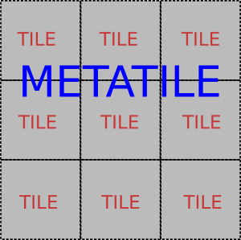

.. _metatile:

Metatile
========

A metatile is essentially several tiles combined into one larger one:

   
   *The example above shows a 3x3 metatile, covering 9 regular (usually 256px by 256px) tiles.*

The most significant advantage of metatiling is that you avoid duplicate labeling of features that span several tiles, like roads. The labels are generally printed once for each metatile. You may also achieve better overall performance, because it is cheaper for the WMS backend to generate one large image rather than 9 small ones. The reason for this is that the WMS backend only incurs the overhead associated with one request and only has to scan its resources (Postgis datastore, Shapefiles) once.

.. figure:: duplicate_labels.png
   :align: center
   
   *An example showing duplicate labels, exasperated by the two directions being modeled as two separate linestrings*

The disadvantage is that each metatile is larger. This makes it slower to render than any single tile, which can be an issue for areas that have not been seeded.

If you go past 3x3 metatiling memory consumption may also become an issue. In general you can estimate memory consumption by determining the total number of pixels and then multiply this number by the color depth 32 bits (4 bytes). A typical 3x3 metatile will therefore require at least (256x256)x(3x3)x(4) = 2359296 bytes = 2304 kbytes = 2.25 mbytes of memory to compute. The real number is often a multiple of this. For instance, in GeoServer the amount of memory is also proportional to the number of featureTypeStyle elements in the style.

Note that several backends also support a parameter to indicate that the client is tiling. If you are using metatiling in GeoWebCache you should generally set this to false, to prevent the backend from metatiling the metatiles. For examples, if you use 3x3 metatiling (768x768 pixels), and have tiled=true, then the server may metatile these large tiles, resulting in a 2304x2304 canvas. (Note that GeoServer will ignore the directive for requests that are not 256x256.)

Configuring Metatiling
----------------------

Metatiling can be configured either on a per-layer basis, or for all layers from a getcapabilities document..

Note that you can seed up to a certain zoomlevel and then reduce metatiling, to ensure adequate response times where the map has not been seeded.
