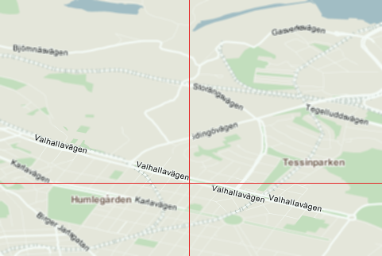

.. _concepts.metatiles:

Metatiles
=========

What's a metatile?
------------------

A **metatile** is one larger tile combining several tiles.  GeoWebCache will request metatiles from the WMS and then slice the metatile into smaller tiles for caching.

.. figure:: img/metatile.png
   :align: center
   
   *The example above shows a 3x3 metatile, covering 9 regular tiles.*

The default setup is a 3x3 metatile with 256 pixel square tiles, so GeoWebCache will make requests for 768 x 768 pixel metatiles.

Why use metatiles?
------------------

The most significant advantage of metatiling is to avoid duplicating the labeling of features that span more than one tile.  Road labeling is an example of this, but any line or polygon can exist at the edge of a tile boundary, and thus be labeled once on each tile.

   
   *An example showing duplicate labels on a tile boundary*

Metatiling may also achieve better overall performance.  It is usually faster for the WMS backend to generate one large image rather than many small ones, since the WMS would only incur the overhead associated with one request.

Why not use metatiles?
----------------------

The disadvantage of metatiling is that since the metatile is larger, it is slower to render than any individual tile would be.

Memory consumption may also become an issue.  The amount of memory to compute a tile is proportional to the size of the metatile, the color depth of the tile, and other factors (such as the number of FeatureTypeStyle element in an SLD).  A single 3x3 metatile with 256 square pixel tiles with 32 bit (4 byte) color depth would require at least (256*256)*(3*3)*4 = 2359296 bytes = 2304 kB = 2.25 MB of memory to compute.

Preventing double-metatiling
----------------------------

Several backends also support a parameter to indicate that the client is tiling. If you are using metatiling in GeoWebCache, you should generally set this to False to prevent the backend from metatiling the metatiles. For examples, if you use 3x3 metatiling (768x768 pixels), and have tiled=true, the server may metatile these metatiles, resulting in a 2304x2304 canvas.

.. note:: If being used as the backend, GeoServer will ignore the directive for requests that are not 256x256 pixels.

Configuring Metatiling
----------------------

Metatiling can be configured either on a per-layer basis, or for all layers in a capabilities document. The former is configured in :file:`geowebcache.xml`, the latter in :file:`geowebcache-core-context.xml`.

.. note:: You can seed up to a certain zoom level at one metatile setting and then reduce metatiling, to ensure adequate response times where the map has not been seeded.
