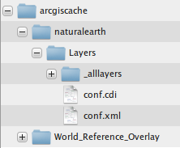

.. _configuration.layers.arcgistilingschemes:

Serving Layers From Pre-Cached ArcGIS Tiling Schemes
====================================================

GeoWebCache can serve cached tiles created by ArcGIS Server 9.2, 9.3 and 10.x, in either the so called "exploded format" or the "compact format" introduced in ArcGIS Server 10.

Features and Limitations
------------------------
GeoWebCache can publish pre-generated caches in ArcGIS exploded format, it cannot seed or truncate these layers. So if you have a set of cached Layers created with ArcGIS Server, you can publish them using GeoWebCache as WMS-C Layers without needing to have ArcGIS Server running at all.

Also, GeoWebCache supports only `fused` ArcGIS caches. That is, caches that contain a single tile set for all the layers in the cached ArcGIS Map.

ArcGIS Tiling Scheme
--------------------

The file structure of such caches is as follows:

In this example, the :file:`arcgiscache` folder is the root of the ArcGIS Server cache directory. It contains two cached layers: :file:`naturalearth` and :file:`World_Reference_Overlay`. Each of them contains a :file:`Layers` folder which in turn has two files: :file:`conf.xml` and :file:`conf.cdi`, and an :file:`_allLayers` folder.

In ArcGIS terminology, each of these cached layers constitutes "fused caches", since there's a single :file:`_allLayers` folder holding the tile files for all the overlaid layers composing that "Map".

The :file:`conf.xml` (sometimes `Conf.xml`) XML file contains the 'ArcGIS Tiling Scheme' definition, containing information about the Layer's Coordinate Reference System, the 'tileOrigin', and tile dimensions, the tiles image format, and the list of zoom levels defined by a pair of equivalent resolutions and scale denominators, among other information.

The :file:`conf.cdi` file is an accompanying XML file that defines the actual bounding box of the Layer cached by this tile set.

The structure of the "conf.cdi" file is as follows:

.. code-block:: xml

  <EnvelopeN>
    <XMin>-180</XMin>
    <YMin>-90</YMin>
    <XMax>180</XMax>
    <YMax>90</YMax>
  </EnvelopeN>

.. note:: GeoWebCache will need those two files to automatically create a GridSet and GridSubset for this Layer. If your cache does not come with a :file:`conf.cdi` file (ArcGIS Server versions prior to 10.0) you will need to create one by hand and place it next to :file:`conf.xml`, so that GeoWebcache can map that to its internal representation of the grided set of tiles.

Configuration
-------------
An 'arcgisLayer' element needs to be created in :file:`geowebcache.xml` under the 'layers' section (i.e. at the same level as the 'wmsLayer' entries). 
'wmsLayer' definitions and 'arcgisLayer' definitions can be intermixed.

This is an example :file:`geowebcache.xml` fragment showing how to set up such a cached Layer:

.. code-block:: xml

  <gwcConfiguration>
    <gridSets>
    </gridSets>
    <layers>
      <wmsLayer></wmsLayer>
  
      <arcgisLayer>
        <name>naturalearth</name>
        <tilingScheme>C:\\arcgiscache\\naturalearth\\Layers\\conf.xml</tilingScheme>
      </arcgisLayer>
    </layers>
  </gwcConfiguration>

The 'name' element is the Layer name that GeoWebcache use to publish the ArcGIS cache.
The 'tilingScheme' element expects the full path to the cache's :file:`conf.xml` file.

Alternative cache directory
---------------------------
It is also possible to get rid of the standard tiling scheme layout and separate out the location of the `conf.xml` file and the directory that actually holds the tiles, by using the ``tileCachePath`` property:

.. code-block:: xml

      <arcgisLayer>
        <name>naturalearth</name>
        <tilingScheme>C:\\arcgiscache\\naturalearth\\Layers\\conf.xml</tilingScheme>
        <tileCachePath>D:\\arcgistiles\\naturalearth\\</tileCachePath>
      </arcgisLayer>

Levels hex-encoded
------------------
Configure whether or not the z-values (levels) should be hex-encoded or not by using the ``hexZoom`` property. Default to false (decimal).

.. code-block:: xml

      <arcgisLayer>
        <name>naturalearth</name>
        <tilingScheme>C:\\arcgiscache\\naturalearth\\Layers\\conf.xml</tilingScheme>
        <hexZoom>true</hexZoom>
      </arcgisLayer>

OpenLayers Configuration
------------------------

One peculiarity of ArcGIS Tiling Schemes is that they define an explicit cache tile origin as an X/Y coordinate in the cache's Coordinate Reference System, that is located at the top left of the tiling scheme valid coordinate range. Since both GeoWebCache and OpenLayers by default compute tile bounding boxes based on the bottom left GridSet envelope corner, it is necessary to instruct OpenLayers to use an explicit 'tileOrigin' for each Layer served off an ArcGIS Tiling Scheme.

The GeoWebCache demo pages for this kind of Layers do that automatically.

To set up an OpenLayers WMS layer that access an ArcGIS cache through the GeoWebCache WMS interface, use the Layer's tileOrigin property as in the following example::

  var demolayer = new OpenLayers.Layer.WMS("naturalearth","../service/wms",
    {layers: 'naturalearth', format: 'image/png' },
    { tileSize: new OpenLayers.Size(256,256), 
      tileOrigin: new OpenLayers.LonLat(-180.0, 90.0)});
  map.addLayer(demolayer);

And make sure the 'tileOrigin' property matches the tile origin defined in :file:`conf.xml`.

.. note:: The OpenLayers tileOrigin property is available in OpenLayers 2.11 and later.

