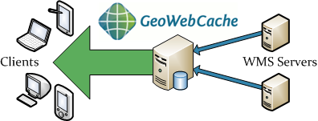

.. _whatis:

What Is GeoWebCache?
====================

Maps are often static. As most mapping clients render WMS (Web Map Service) data every time they are queried, this can result in unnecessary processing and increased wait times. GeoWebCache optimizes this experience by saving (caching) map images, or tiles, as they are requested, in effect acting as a proxy between client (such as `OpenLayers <http://openlayers.org>`_ or `Google Maps <http://maps.google.com>`_) and server (such as `GeoServer <http://geoserver.org>`_, or any WMS-compliant server). As new maps and tiles are requested, GeoWebCache intercepts these calls and returns pre-rendered tiles if stored, or calls the server to render new tiles as necessary. Thus, once tiles are stored, the speed of map rendering increases by many times, creating a much improved user experience.

In the picture above, the blue box on the GeoWebCache machine represents the tile storage. Ideally, most requests are answered from this storage without consulting the WMS server(s). Hence the arrow to the clients is drawn much larger, because GeoWebCache can answer hundreds or thousands of requests per second.

GeoWebCache can even be used in the case when maps aren't completely static, since it allows for the selective expiration of tiles, so that data remains current.  In this respect GeoWebCache acts as an all-purpose accelerator for map rendering.