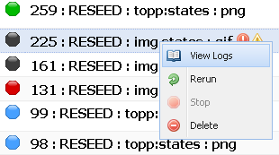

.. _webinterface.jobs:

Job Manager Page
================

The Job Manager page contains a listing of all jobs currently in the GeoWebCache system. This includes currently running jobs, finished jobs and jobs that are scheduled to be run.

The URL format of the job manager is::

  http://<GEOWEBCACHE_URL>/joblist.html

An example of the job manager can be seen here: :download:`Job Manager Example `

Each job is represented as a row in the table and contains various information. From left to right the columns are:

.. list-table::
   :widths: 25 75
   :header-rows: 1

   * - Column
     - Description
   * - :guilabel:`State`
     - The job can be in one of many states, including ready to run, running or complete.
   * - :guilabel:`Job`
     - A summary of the job helpful in identifying which job it is. Included information is the job ID, job type (SEED, RESEED or TRUNCATE), layer and image format. Error and warning alerts appear in this column as well if the job has logged any.
   * - :guilabel:`Region`
     - Information about what geographic region and zoom levels are involved in the job. This includes gird set information such as projection and extents, and zoom levels.
   * - :guilabel:`Time`
     - How long the job has been running or ran for, and an estimate of how much time the job will take to complete.
   * - :guilabel:`Tiles`
     - When the job is running or complete this shows what percentage of the tiles involved have been processed, and how many tiles are involved.
   * - :guilabel:`Threads`
     - Number of threads that this job spawns to run.
   * - :guilabel:`Throughput`
     - When the job is running or complete this column shows what throughput the job is achieving. This is in **requests per second**, not tiles. If a maximum throughput has been set, this is shown in this column as well.
   * - :guilabel:`Schedule`
     - Shows if the job is a repeating job or if it's a scheduled once off job. Also shows the `CRON <http://en.wikipedia.org/wiki/Cron>`_ string for the job if one is set.

.. note:: Some of the job information can be verbose. Icons are used to save space, but the information is available by hovering over the icon.

Table Features
--------------

The table supports features such as ordering based on a column, hiding and showing columns and dragging the columns to different locations in the table. Keep in mind that adjustments to the table aren't remembered between sessions.

The table doesn't automatically update itself but there is a handy refresh button at the top right, next to the help button.

Job States
----------

Jobs can be in a variety of states. What you can do to a job depends on what state it is in. Below is a list of the different states a job can be in.

**UNSET** - A job that hasn't had it's status set yet. It's rare that you will see a job with this status, but newly created jobs do have this state momentarily.

**READY** - Jobs that are ready to run are in this state. Because ready jobs that aren't scheduled will run straight away, you'll usually only see scheduled jobs waiting to start with this state.

**RUNNING** - Jobs that are actively processing with no problems.

**RUNNING** - Jobs that are actively processing but have recorded one or more failed tiles.

**DONE** - Jobs that have completed successfully.

**DONE** - Jobs that have completed with one ore more failed tiles.

**INTERRUPTED** - Jobs can be interrupted by unexpected server shutdown, or detected as interrupted on restart if the job was left in a running state. Interrupted jobs are automatically restarted on startup.

**KILLED** - Jobs that have been terminated prematurely, probably due to user intervention. Jobs that have been stopped before completion have this state.

**DEAD** - Jobs that have terminated abnormally. Jobs can die if connectivity to the backend service providing the map imagery is lost, or too many tile requests fail.

Manipulating Jobs
-----------------

The job list has a context menu accessible by right clicking on a job. This allows access to log information for the job as well as commands that can be performed on the job. Not all actions are available to all jobs, it depends on the state the job is in.

.. list-table::
   :widths: 25, 75
   :header-rows: 1 

   * - Action
     - Description
   * - .. image:: img/logs.png
		:align: left
		:class: float_left

       :guilabel:`View Logs`
     - Each job has a history associated to it in the form of logs. Each log entry is timestamped, and can be a warning, error or simply informative. Log entries have a summary as well as more detailed text. An example of the log window for a job can be seen here: :download:`Job Logs Example `.
   * - .. image:: img/clone.png
		:align: left
		:class: float_left

       :guilabel:`Clone`
     - Duplicates a job. Currently cloned jobs are executed immediately.
   * - .. image:: img/rerun.png
		:align: left
		:class: float_left

       :guilabel:`Rerun`
     - Restarts a completed job. Similar to clone as a new job based on the completed one is created to ensure the original job information is kept.
   * - .. image:: img/stop.png
		:align: left
		:class: float_left

       :guilabel:`Stop`
     - Stops a running job. Stopped jobs are halted and their state changes to ''KILLED''.
   * - .. image:: img/delete.png
		:align: left
		:class: float_left

       :guilabel:`Cancel / Delete`
     - Cancels a job that hasn't been run yet, or deletes a completed job. In both cases all record of the job is removed from the system.

Interrupted jobs
----------------

Jobs that have been interrupted, perhaps due to an unexpected shutdown of GeoWebCache, will be automatically restarted when GeoWebCache restarts. This is done by looking for jobs that have running or interrupted states when GeoWebCache starts.